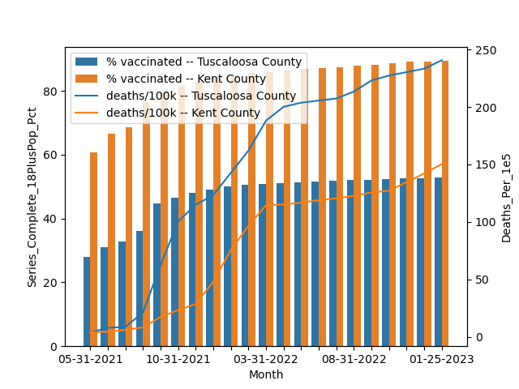

# Exploring COVID-19 Vaccine Effectiveness

## Overview 
This project is a continuation and improvement on a project that was done in 2022 which you can view and read [here](https://github.com/ds5010/vaccines), which explored the relationship between COVID-19 vaccinations and deaths attributed to the disease in the United States between 5/31/21 - 11/30/21 to analyze the effectiveness of the vaccination over time.

The first project conducted the analysis for dates between 5/01/21 - 01/31/23. Our own attempt is to expand this analysis to January 2023 when people are less wary of the COVID-19 disease and see if and/or how thinigs have changed since then.

Data in this repo was accessed on Wednesday, February 17 2023.


## Data
COVID-19 vaccination related [data](https://data.cdc.gov/Vaccinations/COVID-19-Vaccinations-in-the-United-States-County/8xkx-amqh) is from Center For Disease Control and Prevention (CDC) and COVID-19 deaths [data](https://github.com/CSSEGISandData/COVID-19/tree/f57525e860010f6c5c0c103fd97e2e7282b480c8) from Johns Hopkins University (JHU). 


## Date Changes
The CDC data was previously updated daily by the CDC since May 24, 2021 (the file contains data about vaccinations beginning in December 2020, though), but was later changed to be updated weekly for data from the previous week's Wednesday up to the present week's Wednesday. Because of this, we focused on data up to the last wednesday of every month.

The JHU data is still released daily.

`months.csv` was updated accordingly.

## Running The Code 

A [Makefile](./Makefile) is retained to streamline code compilation. To execute if data is already in your local (after cloning), run the makefile in order:

1. Create a time series of scatter plots and save .png files to the 'img' directory
```
make scatters
```
2. Generate an animation using the plots generated above
```
make animation
```
3. Start a basic python development server to view the docs on a local machine
```
make serve
```
### Else

Else if you do not already have the data in local, or have wrong or incomplete data, run:
```
make all
``` 
This will allow you download the data, merge the files, plot the data and create the plots.

## Output
Assuming all is well, the output should look something like this:

and this:


## Analysis - National View
In still considering the trajectories of the large bubbles (representing highly populous counties) vs. their smaller counterparts, most of the largest bubbles progress continued even upwards to 90-100% vaccinated range by the end of the timeframe, and their rate of deaths generally tops out at 280 deaths/100K people. Many smaller bubbles improved significantly with many close to the 80% vaccinated rrange, but several of their death rates soared even higher passed the 300-400 deaths/100K range, especially those between the 40-70% vaccination range. 

Comparing these two groups suggest that vaccination is highly effective--otherwise the more highly-populated areas would likely have similar (or even worse) death rates, given the physical proximity of the population in these urban centers.   
  
Regional differences prove to be fertile ground for continued research. Many of the small blue dots, representing counties in the South, don't reach the 50% vaccinated threshold. However, the large blue bubbles (representing urban areas in the South) follow a more direct left-to-right trajectory--and tellingly, keep their death rates low.  
  
These findings suggest that behavioral differences rural vs. urban communities (mask wearing, social distancing, etc.) or differences in political ideology may affect vaccine adoption--but they offer little doubt that the COVID vaccines are effective at minimizing the death toll of the virus. 
  
## Analysis - County View
This bar-line plot visualization retained a county-level comparison between Kent County, RI and Tuscaloosa County, AL.

The percentage of the population in Kent county that is vaccinated continued to increase signiificantly from May 2021 up until February 2023, plateaud till March 2023, and started a gradual iincrease from April 2023. However in Tuscaloosa county that is vaccinated continued to increase significantly from May 2021 till around January 2022, but began to plateau after that and even began a slight decline by October 2022. 

The number of deaths also increases over time (please note that the number of deaths is a cummulative measure), but Kent, RI began to plateau to a more gradual increase from March 2022 and then a sharp increase by October 2022. On the other hand, Tuscaloosa, AL saw that plateau and gradual increase from April 2022 to July 2022 but continued an  upward climb from then on.

The differences between Kent, RI and Tuscaloosa, AL seems to remain even so. The behaviour of members of Kent, RI towards vaccinations remains positive. 

The visualization additionally retains a very noticeable difference between the number of deaths in Kent county and that of Tuscaloosa, AL. 

However, it is still interesting to see that the conclusion from the analysis of all U.S. counties is the same as the analysis from individual county perspective.

## Acknowledgements

The inspiration to visualize vaccine rate v death rate for this project came from the following NPR article: [Pro-Trump counties now have far higher COVID death rates. Misinformation is to blame.](https://www.npr.org/sections/health-shots/2021/12/05/1059828993/data-vaccine-misinformation-trump-counties-covid-death-rate)


### Contributors

[Philip Bogden](https://github.com/pbogden) | [Wendy Thress](https://github.com/WendyThress-Roux) | [Tom Henehan](https://github.com/tom2470) |
[Mohammed Shati](https://github.com/Moshati1315) | [Dan O'Brien](https://github.com/dobnu) | [Funmi Somoye](/https://github.com/FunmiSomoye-schl) | [Philip Tran](https://github.com/Phitran-neu) | [Mitch Hornsby](https://github.com/mhorns) | [Jayati Samar](https://github.com/smr-j) | [Peter Sternhagen](https://github.com/petersternhagen) | [Joe Schweiss](https://github.com/joschw01)
